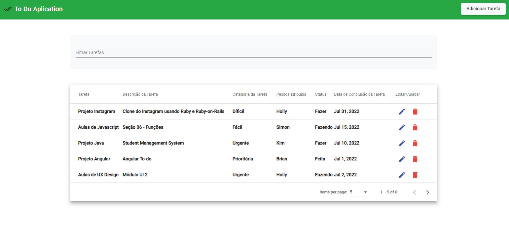
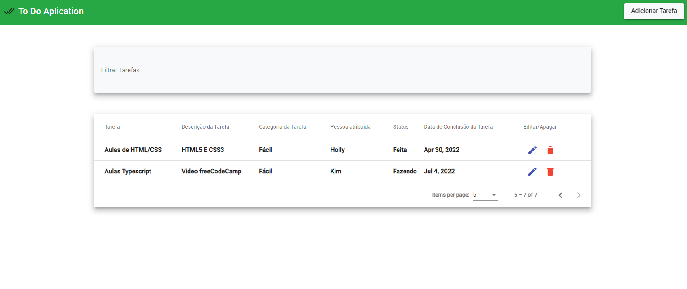

# ProjectToDo

Projeto To-Do aplication usando Angular, Material UI, Bootstrap 4, json server para API.

Inspirado no Template: Design Task do Notion e no video https://www.youtube.com/watch?v=jGbP620NahE&t=1516s.

Página 01

Página 02

]

